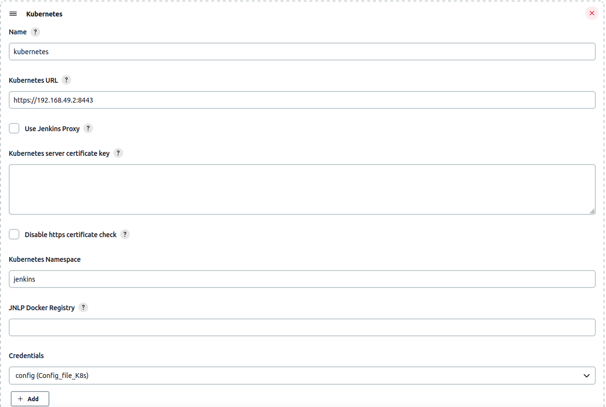
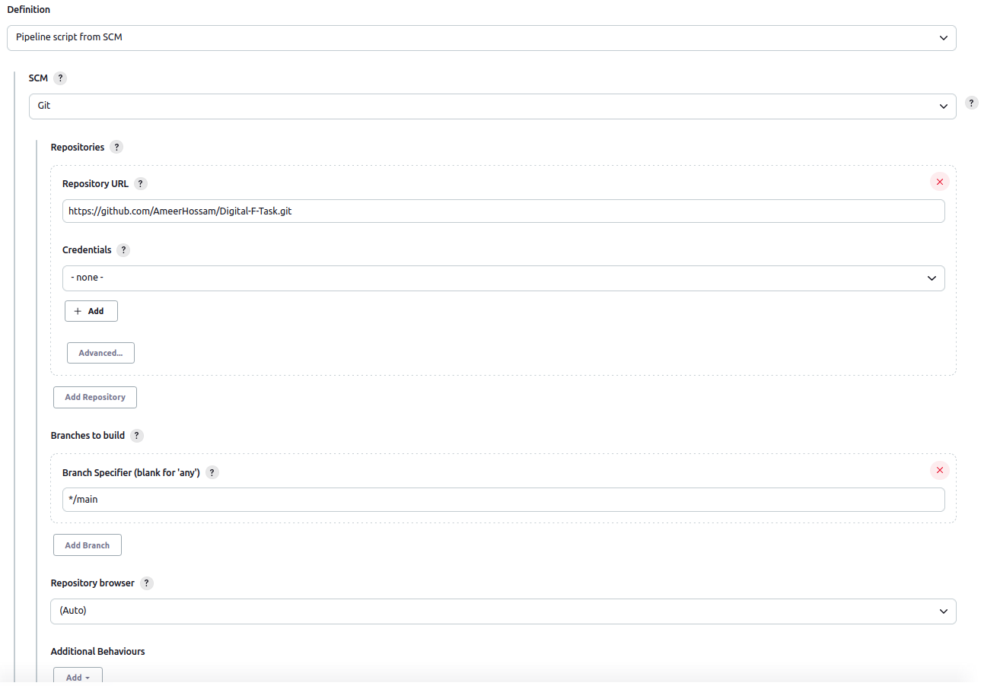

# Deploy spring-app using k8s and Jenkins

### - Make a docker file
```Dockerfile
FROM gradle:7.5.1-jdk11-alpine AS build

COPY --chown=gradle:gradle . /home/gradle/src

USER root

RUN chown -R gradle /home/gradle/src

WORKDIR /home/gradle/src

RUN gradle build --scan

RUN echo $(ls /home/gradle/src/build/libs/)


FROM openjdk:17.0.1-jdk-slim

EXPOSE 8080

RUN mkdir /app

COPY --from=build /home/gradle/src/build/libs/demo-0.0.1-SNAPSHOT.jar /app/spring-boot-application.jar

CMD ["java","-jar", "/app/spring-boot-application.jar"]
```

### - Create a Docker file for Jenkins has Kubectl and docker installed inside iti
```Dockerfile
FROM jenkins/jenkins:lts
USER root

# install Docker client
RUN apt-get update -y && apt-get install -y apt-transport-https ca-certificates curl software-properties-common gnupg2
RUN curl -fsSL https://download.docker.com/linux/debian/gpg | apt-key add -
RUN add-apt-repository "deb [arch=amd64] https://download.docker.com/linux/debian $(lsb_release -cs) stable"
RUN apt-get update -y && apt-get install -y docker-ce

RUN usermod -aG docker jenkins


#install Kubectl
RUN curl -LO https://storage.googleapis.com/kubernetes-release/release/$(curl -s https://storage.googleapis.com/kubernetes-release/release/stable.txt)/bin/linux/amd64/kubectl
RUN chmod +x ./kubectl
RUN mv ./kubectl /usr/local/bin

RUN apt-get update && apt-get install -y apt-transport-https gnupg2 
RUN curl -s https://packages.cloud.google.com/apt/doc/apt-key.gpg | apt-key add - 
RUN echo "deb https://apt.kubernetes.io/ kubernetes-xenial main" | tee -a /etc/apt/sources.list.d/kubernetes.list 
RUN apt-get update && apt-get install -y kubectl

RUN usermod -aG root jenkins

```

### - Install some Jenkins Plugins like Gradle,Maven and Kubernetes
``` 
to get the K8S URL, run this
$ kubectl cluster-info

then we need to copy the config (~/.kube/config) and 
replace (certificate-authority,client-certificate and client-key) 
with their values (just run this to get the value) $ cat $(Path of the crt)
```



### Create namespace, ServiceAccount and RoleBinding for the cluster
```bash
$ kubectl create namespace jenkins
$ kubectl create serviceaccount jenkins --namespace=jenkins
$ kubectl create rolebinding jenkins-admin-binding --clusterrole=admin --serviceaccount=jenkins:jenkins --namespace=jenkins
```
### Now we have a ready infrastructure to run both docker and k8s inside jenkins pipeline

### connect your git repository with the jenkins pipeline project


### the pipeline used
```Pipeline
pipeline{
    agent any
    stages{
        stage("Build stage"){
            steps{
                withCredentials([usernamePassword(credentialsId :'DockerHubCred',usernameVariable :'USER',passwordVariable :'PASSWORD')]){

                sh 'docker build -t sudo1amir/springdf:v1 .'
                sh 'echo $PASSWORD | docker login -u $USER --password-stdin'
                sh 'docker push sudo1amir/springdf:v1'
                }
            }
        }

        stage("Deployment stage"){
            steps{
                    sh 'kubectl apply -f ./k8s -n jenkins'
            }
        }
    }
}
```
